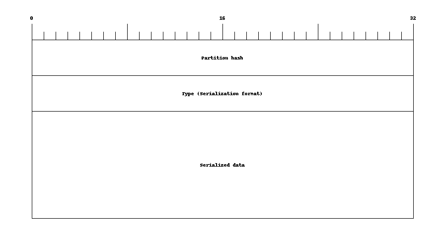

# Hazelcast 4+ member protocol dissector for WireShark


## What's dissected

### Protocol header

Just 3 bytes: `HZC`

### Member packet


### HeapData (payload)



### Serialized DataSerializable

```
Type (Serialization format) = -2
IDS flag=0
````


### Serialized IdentifiedDataSerializable

```
Type (Serialization format) = -2
IDS flag=1
````


## Building on Ubuntu (20.04)

### Prerequisities

```bash
sudo apt install build-essential wireshark wireshark-dev cmake
```

### Build and install

```bash
# it's cleaner when we don't build it direcly in the source dir - let's create a separate one
mkdir build
cd build
cmake ..
# build and install it to ${HOME}/.local/lib/wireshark/plugins/...
make install
```

*For building whole Wireshark from sources take a look at https://gist.github.com/syneart/2d30c075c140624b1e150c8ea318a978*

### Generate packet layout images

```bash
sudo pip3 install nwdiag
cd imgs
for i in *.diag; do packetdiag $i; done
```